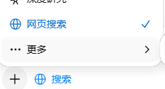

# RAG 技术学习

## 基本介绍

RAG, 全称Retrieval-Augmented Generation, 是一种基于检索的生成模型。retrieval-augmented，检索增强。从名称上看，侧重于说明功能。

即使再NB的模型，目前也无法知道所有知识。一些场景下，只需要基于特定知识库来回答，那显然也没有必要根据这些知识库再训练一个模型。自然而然的，可以想到大模型有着很强的总结归纳能力，那么如果把技术路线设计为：
1. 检索相关外部信息
2. 丢给模型进行总结
技术成本和实现效果上都会很美好。

目前普通人接触到的RAG，比如很多LLM的前端都会提供一个”网络检索“功能，这就是RAG技术的一种实现。

### 和模型微调的区别

上面说针对“获取特定领域知识”这个需求，RAG走的是“临时去查资料”这个路线。而模型微调就走的是“永久学习”这个路线。微调本质上还是要进行训练，只不过不用从头开始训练（由于数据集，成本之类的原因）。形象点说，你问一个医学问题，RAG就是一个阅读和检索能力很强的高中生，在查资料后给你了答案，微调就是医生来回答这个问题。

## 技术原理

RAG的流程有下面几个步骤：
1. 建立索引。本质上是在做把知识库写入数据库这样的操作。
    a. 首先要把文档切分成chunk。chunk的大小还有说法，多了包含的信息多，检索不准确；少了虽然准确了，但是上下文丢失，不一定是真准确。
    b. 然后对每个chunk进行embedding。实际上是在做将文字信息转换为高维向量的操作。
    c. 最后把这些向量写入数据库。建立向量和原始文本的链接。
2. 检索。这个过程实际上是在找向量相似度。
    a. 把用户的输入embedding化。
    b. 计算输入和数据库中每个向量的相似度。找出top k个。
    c. 从数据库中找和输入最相似的chunk。
3. 生成generation。
    a. 把这些chunk和用户的输入拼接起来作用prompt。
    b. 模型根据这些信息生成答案。