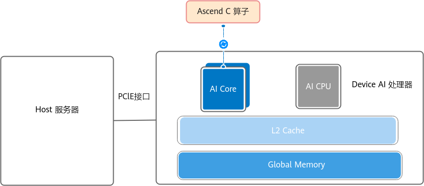

# 主流AI卡架构

## 写在前面

准备开个新坑，学习一下当前主流AI计算卡的架构。

## NVIDIA GPU架构


学习GPU架构，NVIDIA 肯定是绕不开的。硬件层次上，简单的划分就是GPU->GPCs->SMs，这样的包含关系，但是实际上更关注SM。可以认为SM是GPU的基本计算单元，每个SM都有自己的寄存器文件、共享内存、L1缓存、L2缓存等。

CUDA编程模型和SM的设计密切相关。CUDA程序中：

```cpp
__global__ void kernel(int *a, int *b, int *c) {
    int tid = blockIdx.x * blockDim.x + threadIdx.x;
    c[tid] = a[tid] + b[tid];
}

int main(){
    int *a, *b, *c;
    int size = 1024;
    cudaMalloc((void**)&a, size * sizeof(int));
    cudaMalloc((void**)&b, size * sizeof(int));
    cudaMalloc((void**)&c, size * sizeof(int));
    // kernel<<<blockPerGrid, threadPerBlock>>>(args);
    kernel<<<1, size>>>(a, b, c);
    cudaFree(a);
    cudaFree(b);
    cudaFree(c);
    return 0;
}
```
开发者能控制的就是blockPerGrid和threadPerBlock，这两个参数确定了CUDA程序在GPU上的并行度。threadPerBlock最大为1024，以32个线程为一个warp，warp是SM进行计算的基本调度单位。

## Ascend NPU

GPU的全程是Graphics Processing Unit，而NPU的全程是Neural Processing Unit。从名字上可以看出，GPU主要用于图形渲染，而NPU主要用于神经网络计算。




AI core负责矩阵，矢量计算，对应的，AI core包括：
1. 计算单元：包括cube，vector和scalar计算单元。
2. 存储单元：包括L1 Buffer、L0A Buffer、L0B Buffer、L0C Buffer、Unified Buffer、BiasTable Buffer、Fixpipe Buffer等专为高效计算设计的存储单元。这里存储单元的类型显然比GPU的要复杂很多。
3. 搬运单元：包括MTE1、MTE2、MTE3和FixPipe，用于数据在不同存储单元之间的高效传输。

计算单元中，需要区分cube, vector和scalar计算单元。
- cube计算单元：负责矩阵乘法计算，每个cube计算单元一次可以处理两个fp16的16x16矩阵乘。
- vector计算单元：负责矢量计算，每个vector计算单元一次可以处理两个fp16矢量的相乘或相加。
- scalar计算单元：负责标量计算和程序的流程控制（循环，分支）

**存储单元**中，AI Core的主要内部存储包括：L1 Buffer（L1缓冲区），L0 Buffer（L0缓冲区），Unified Buffer（统一缓冲区）等。为了配合AI Core中的数据传输和搬运，AI Core中还包含MTE（Memory Transfer Engine，数据传递引擎）搬运单元，在搬运过程中可执行随路数据格式/类型转换。（具体作用可以参考昇腾文档）

对于cube计算单元的数据流向：
1. GM →L1→L0A/L0B →Cube →L0C→FixPipe→GM
2. GM →L1→L0A/L0B →Cube →L0C→FixPipe→L1

对于vector计算单元的数据流向：
- GM → UB → Vector → UB → GM

同样的，ascend编程模型的设计也依托于硬件设计，官方的介绍中，[编程范式](https://www.hiascend.com/document/detail/zh/canncommercial/83RC1/opdevg/Ascendcopdevg/atlas_ascendc_10_00015.html)如下：

1. 获取Local Memory的内存：调用AllocTensor申请内存，或者从上游队列DeQue一块内存数据。
2. 完成计算或者数据搬运。
3. 把上一步处理好的数据调用EnQue入队。
4. 调用FreeTensor释放不再需要的内存。

这里以昇腾官方的

## 参考

1. https://docs.nvidia.com/cuda/cuda-programming-guide/01-introduction/programming-model.html#gpu-hardware-model
2. https://www.hiascend.com/document/detail/zh/canncommercial/83RC1/opdevg/Ascendcopdevg/atlas_ascendc_10_0008.html