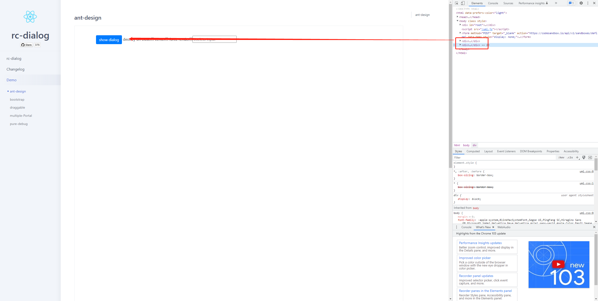
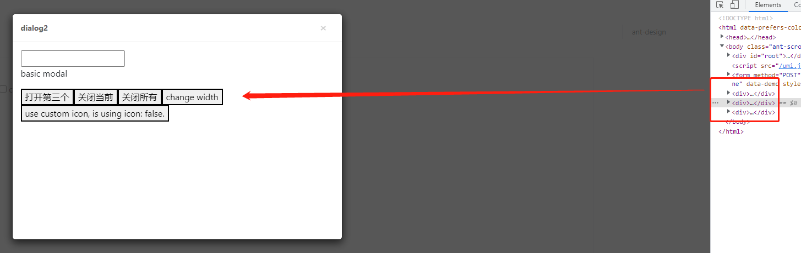

# 单例模式
> 保证一个类仅有一个实例，并提供一个访问它的全局访问点。

业务中更加形象的理解是：只要这是一个全局唯一的功能，都可以使用单例模式。甚至在有经验的前端看来，单例模式就是一种自然而然的写法。比如一个登录弹窗，显然是全局唯一的，无论在项目的哪个地方调用了这个弹窗，都应该始终使用的是这同一个弹窗。
## 场景复现
### 弹窗
我经历过的一个场景是，一个卡片列表，点击卡片会弹窗（项目中为antd的Modal），一个时刻只有一个弹窗，弹窗只和这个卡片有值传递，那么这个弹窗要写在哪呢？

有两种方案，一种是基于弹窗和卡片有值传递，那么这个弹窗应该放在卡片组件内。但是这样带来的潜在问题是，有多少个卡片，就会有多少个弹窗。虽然这影响并不大，只会在切换弹窗的时候对弹窗的dom节点反复卸载安装，也不怎么影响性能。当然，这是直觉上的判断，具体还是需要根据Modal组件的实现来判断的。然后我就顺着组件库找到了`rc-dialog`，稍微看了下源码我就知道不是一时半会能解决的了。所以先来一波逆向！
在[rc-dialog的demo](https://dialog-react-component.vercel.app/demo/ant-design)中，可以先浅看一下dom结构：

可以发现，有多少个modal（这里叫dialog），就会在body上append几个div，这些div就是modal的container了。我原本预想的是rc-dialog使用单例模式实现全局唯一的一个弹窗，但是组件开发者显然比我考虑的更周全，它这个弹窗是可以呼出另一个弹窗来任意嵌套的。所以并没有限制弹窗数量。但我发现了另一个值得学习的点，modal实现了惰性单例，只有在点击的时候才会创建一个div并append到body上。这样看来，第一种方案modal放在card组件中就不合适了，用户每点一个card，就会在body上append一个div，虽然Chrome很强大，再多点div也不会怎么样，但是在学过设计模式的码农看来就不太好接受了。

*另外，可能我的同事也发现了这个奇怪的地方，但是他的做法是`{visible && <Modal visible={visible}>}`，虽然body上最多只有一个modal的container了，但是这样频繁的remove和append。。。Chrome天下第一！*
第二种方案就是将Modal放在card的同一级，所有的card点击后呼出的都是同一个Modal。这种实现方式下，考虑的props的传递问题更多一点，因为Modal中的内容由card决定，但已经不属于设计模式的范畴了。
### 子菜单
菜单是一个十分常见的业务组件，但是基于UI不同，实现方式可能大相庭径。如果没有特殊要求，随手一个`type Menu = {label:string, value:unknow, children?:Menu[]}`，然后递归渲染，一个简单的菜单就出来了。而我遇到的需求类似于[antd pro vue](https://preview.pro.antdv.com/dashboard/workplace)的菜单。这里只关注收起状态下一级菜单呼出二级菜单的方式。

细细一想这个二级菜单的交互要注意的功能还不少：
1. 在一级菜单上移动，二级菜单可以认为是瞬时移动到对应的一级菜单旁边的；
2. 鼠标从菜单上移开时，二级菜单不是瞬时消失的，二级菜单和一级菜单并不是紧挨着的，如果是瞬时消失，显然鼠标用于不可能hover到二级菜单上。

这个二级菜单也有两种实现方式，一种是每一个一次菜单都包含有二级菜单的dom节点。未完待续。。。。