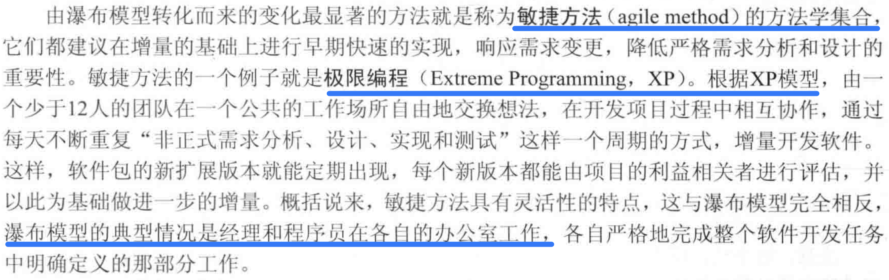

# 如何对项目进行复盘——前端视角
## 写在前面
个人是比较担心成为两年经验用十年的程序员的。从某种角度来讲，项目经验是可以代表一个程序员的实力的，对项目的复盘应该是每次项目结束后的必修课。

项目复盘必须参照一定的方法，并结合个人实践，逐渐总结出个人的一套方法论。我选择从软件工程学科寻找参考方法。
## 复盘方法指导
参考：《计算机科学概论》，J. Glenn Brookshear，第七章，软件工程。
一个软件的生命周期分为：**开发-->使用<-->维护**。根据开发人员的定位和产品的生命阶段，开发人员会重点参与开发阶段或维护阶段。我个人重点参与了开发阶段。传统软件的开发生命周期的步骤是：**需求分析->设计->实现->测试**，这些阶段书中的视角是从全局出发的，对于实际参与开发的大头兵来说：
- 需求分析：读懂产品文档，基本清楚产品最终要什么东西，弄懂what；
- 设计：确定技术方案，知道how；
- 实现：实际开发阶段，专注于do；
- 测试：有能力的会编写单元测试，或进行冒烟测试，之后就是处理来自测试的bug。

除去测试阶段，程序员的关注重点会随着个人实力、工作年限增长而逐渐前移，略显惭愧，我的关注重点仍然在实现上。

根据软件的生命周期，易得复盘顺序及在各个阶段的关注点：
- 需求阶段：后续开发及项目交付后，是否后知后觉的对**需求理解是否出现了偏差？**
- 设计阶段：**选择的技术方案是否有缺陷，如何补救，是否有更好的技术方案？**
- 实现阶段：开发过程是否产生了**阻塞**，有哪些**难点**，有些需求是否可以更接近**最佳实践**？
- 测试阶段：**bug数量**是否超出预计，**bug分布**如何，**产生原因**是什么？

依照上述关注点，能完成一份（个人认为）很不错的复盘总结了，但是需要指出的是，这种总结是出于个人成长的一份利己向的复盘总结，当个人成长到一定程度，利益和集体绑定较深时，关注点有所不同。由于个人能力问题，这里就不画蛇添足了。

另，语雀中有项目复盘模板采用了**GRAI**复盘法，即**Goal->Result->Analysis->Insight**。这里不再详细展开，这也是一种很不错的复盘方法，以成果为关注点进行分析复盘。

在阅读本章时，还发现了一段有意思的内容：

这种对敏捷开发的解释确实和我对国内环境下敏捷开发的实践大相径庭。