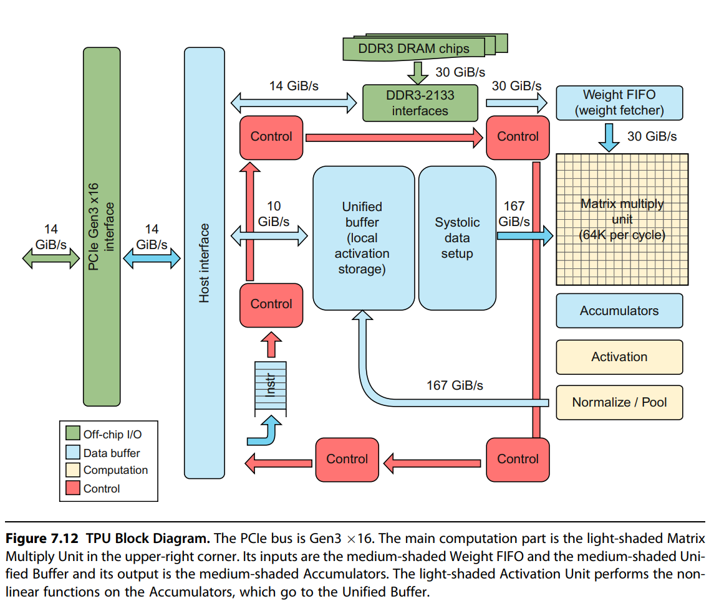
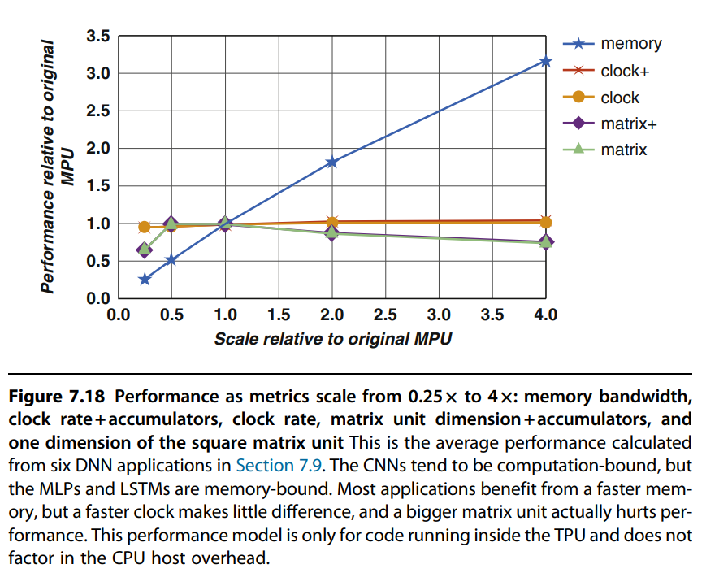

# Domain Specific Architecture

GPU，NPU，TPU，等等都是DSA的一种，根据第一性原理，直接学习DSA的设计思想，先于学习具体的硬件架构。

在讨论DSA的设计思想前，仍然避不开“摩尔定律”。

> 摩尔定律是指集成电路上可容纳的晶体管数量每隔18个月就会增加一倍。这一现象导致了计算机性能的指数级提升。

依靠倍增的晶体管数量，实现了许多提高性能的机制：

1. 多级缓存
2. 多级流水线
3. SIMD单元
4. 分支预测
5. 乱序执行
6. 预取
7. 多线程/多进程

但是依靠物理法则获得的性能提升终有上限，通算芯片已经很难再有重大的突破。这个角度来看，转向DSA是一种“无奈之举”。

DSA的设计思想是：根据应用场景，定制化硬件架构，以提高性能和效率。比之通算芯片，像在做减法。比如DSA芯片并不需要复杂的多级缓存结构。

## DSA的设计原则

1. 使用专用内存来最大限度减少数据搬运成本；
2. 将节省的资源（比如移除的高级微架构）投入到更多的计算资源或更大的内存中；
3. 使用与domain匹配的最简单并行方式（DSA的核心就是并行优化，目前主流的SIMD和SIMT）；
4. 将数据大小和类型简化到领域所需的最简单的程度（GPU支持的fp16，bf16等）；
5. 使用特定领域的编程语言将代码移植到DSA上（目前来看，cuda基本是唯一的选择，其余DSA也基本选择了兼容CUDA路线）；

## example domain： deep neural networks

关于神经网络的基础知识这里不做延申。

做神经网络的DSA，本质上做到很好的支持向量-矩阵，矩阵-矩阵以及一些非线性函数（ReLU，softmax等）的计算即可。

### 谷歌TPU（这里应该指的是1代）

TPU（Tensor Processing Unit）是谷歌设计的专用神经网络处理单元，用于加速深度学习模型的训练和推理。TPU的设计目标是提供高吞吐量和低延迟的神经网络计算，以满足大规模深度学习应用的需求。

TPU的核心是一个65536（256*256）的8 bit ALU矩阵乘法单元和一个大型的片上内存。TPU的单线程/确定性的执行模型可以满足DNN推理应用99%的响应时间要求。

#### TPU的架构

为了降低延迟，TPU被设计为PCIe io总线上的协处理器。服务器可通过总线直接向TPU发送指令，而不需要经过内存的中转。

主机cpu通过PCIe总线将指令发送到tpu的指令缓冲区。矩阵乘法单元是TPU的核心，包含256个ALU，可对有符号或无符号整数执行8bit的乘加运算。16bit的乘积存储在矩阵单元下方的4MiB的32bit累加器中。当混合使用8bit权重和16bit激活时，矩阵单元的计算速度减半。当权重和激活都是16bit时，计算速度减至四分之一。每个cycle可读取256个值，可以执行矩阵乘法或卷积运算。非线性函数由“激活硬件”计算。

权重通过片上的FIFO暂存，FIFO从片外的8GiB DRAM读取数据，中间结果保存在24MiB的片上统一缓存中，该缓存可以作为矩阵乘法单元的输入。

#### 指令集架构

TPU指令遵循CISC指令集的传统。TPU没有程序计数器，也没有分支指令，指令由主机CPU发送，每条指令的周期数通常为10~20。下面是五条关键指令：
1. Read_Host_Memory。从主机内存读取数据到TPU的统一缓冲区中。
2. Read_Weights. 从权重存储器读取权重到FIFO中。
3. MatrixMultiply/Convolution。执行矩阵乘法或卷积运算。
4. Write_Host_Memory。将计算结果写入主机内存。
5. Activation。执行非线性函数（如ReLU、softmax等）。

#### TPU微架构

TPU的微架构的理念是保持矩阵乘法单元的满载运行。方案为将其它指令的执行与矩阵乘法指令执行进行重叠。因此，除了矩阵乘的另外四个指令都有独立的执行单元。

#### TPU改进

架构师创建了一个性能模型，估算了内存带宽，矩阵单元大小，时钟频率，累加器数量对性能的影响。模型预测性能与硬件实际性能平均误差在8%以内。

图中，内存带宽提高4倍，性能提高3倍。时钟频率和累加器数量对性能几乎没有影响。扩展矩阵单元到512*512时，性能略有下降。

基于该模型，使用GDDR5替换当前的ddr3，可将权重存储器的带宽提高5倍以上，即使保持频率不变，性能也会提高3.2倍。（确实说明了推理就是带宽瓶颈）

#### TPU的设计与DSA的相关性

TPU有一个明显的性能瓶颈是使用了PCIe总线，内存带宽较低，进而限制了TPU的性能。但是即便如此，在推理场景下仍然实现了相对GPU 10倍的性价比。如果对TPU重新设计，使用和GPU相同的内存技术，其速度就能提高3倍。

和DSA设计思想的相关性上：
1. 使用专用内存来最大限度减少数据的搬运成本。TPU有一个24M的统一缓存，可用于存储中间矩阵和向量。它针对256字节的访问进行了优化。此外，它还有4MiB的累加器，每个累加器32bit，用于存储矩阵单元的输出，并作为非线性计算单元的输入。8bit的权重存储在独立的片外DRAM中，并通过片上FIFO进行访问。而在通用cpu上，这些类型的数据可能冗余存在多个内存层次结构中。
2. 将节省的资源（比如移除的高级微架构）投入到更多的计算资源或更大的内存中。TPU有28M的专用内存和65536个ALU。TPU整体的体积和功耗只有服务器cpu的一半，但是它的内存容量约为服务器cpu的60%，ALU的数量是其250倍。与服务器GPU相比，TPU的片上内存是其3.5倍，ALU数量是其25倍。
3. 最简单的并行化形式。TPU通过256*256的矩阵乘实现二维SIMD的并行处理，单元内部使用“脉动流水线”结构，并辅以简单的重叠执行流水线，实现卓越的性能。而cpu依赖多进程，乱序和一维SIMD，GPU则需要多进程，多线程和一维SIMD。
4. 数据类型简化。TPU（一代）支持8bit和16bit的整数运算，而不支持32bit的浮点数。CPU和GPU还支持64bit整数和32bit，64bit浮点数。
5. 特定领域的编程语言。TPU使用TensorFlow编程框架，而GPU依赖CUDA和OPENCL，CPU则必须能运行几乎所有程序。

## 参考资料

1. 《计算机体系结构量化研究方法第六版》第七章
