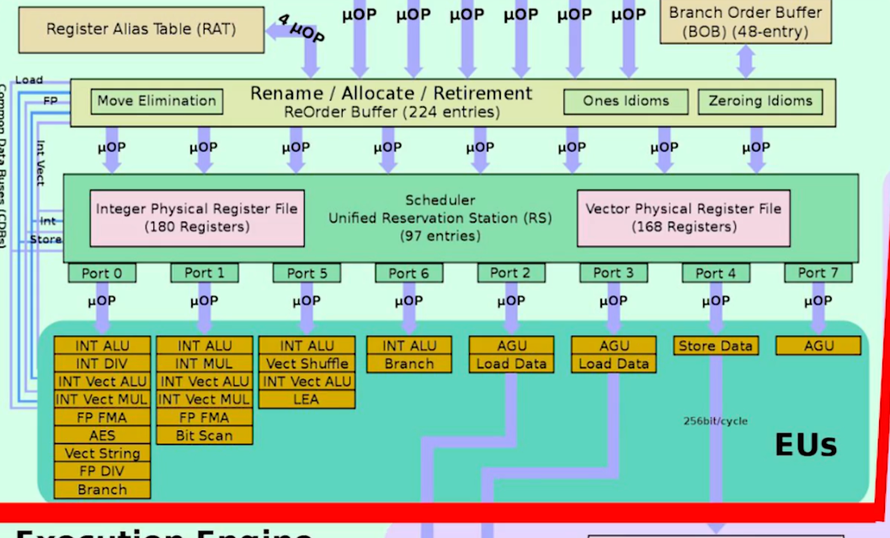

# 从零学习矩阵乘（GEMM）优化

## 基础版本

根据最基础的行列式乘法的计算方法，一个m\*k的矩阵乘上k\*n的矩阵得到一个m\*n的矩阵。用代码表示就是一个三层的循环：

```c
for(int m=0;m<M;m++){
        for(int n=0;n<N;n++){
            C[m][n]=0;
            for(int k=0;k<K;k++){
                C[m][n]+=A[m][k]*B[k][n];
            }
        }
    }
```

这种计算方式就有很大的性能问题，复杂度是O(mnk)，且如果具备一定的硬件知识，对A和B的非连续访问会导致缓存命中率下降，从而影响性能。

## 二维改一维

```c
/* Create macros so that the matrices are stored in column-major order */

#define A(i,j) a[ (i)*lda + (j) ]
#define B(i,j) b[ (i)*ldb + (j) ]
#define C(i,j) c[ (i)*ldc + (j) ]

/* Routine for computing C = A * B + C */

void MY_MMult( int m, int n, int k, double *a, int lda,
                                    double *b, int ldb,
                                    double *c, int ldc )
{
  int i, j, p;

  for ( i=0; i<m; i++ ){        /* Loop over the rows of C */
    for ( j=0; j<n; j++ ){        /* Loop over the columns of C */
      for ( p=0; p<k; p++ ){        /* Update C( i,j ) with the inner
                                       product of the ith row of A and
                                       the jth column of B */
        C( i,j ) = C( i,j ) +  A( i,p ) * B( p,j );
      }
    }
  }
}

```

二维矩阵改一维后，性能上并没有发生明显的提升，毕竟二维行主序转为一维后仍然是行主序（如果一维变为列主序性能反而会下降）

注意GitHub仓库中的写法是列主序，查询后发现Fortran是列主序的。但是显然对于C来说，行主序的性能更高。所以后续的讨论还是以列主序为基础。

## 分块

分块的主要优化逻辑是，尽可能的利用计算单元

### 1x4

尝试在一个循环内执行四次运算

```c
for ( j=0; j<n; j+=4 ){        /* Loop over the columns of C, unrolled by 4 */
    for ( i=0; i<m; i+=1 ){        /* Loop over the rows of C */
      /* Update the C( i,j ) with the inner product of the ith row of A
         and the jth column of B */

      AddDot( k, &A( i,0 ), lda, &B( 0,j ), &C( i,j ) );

      /* Update the C( i,j+1 ) with the inner product of the ith row of A
         and the (j+1)th column of B */

      AddDot( k, &A( i,0 ), lda, &B( 0,j+1 ), &C( i,j+1 ) );

      /* Update the C( i,j+2 ) with the inner product of the ith row of A
         and the (j+2)th column of B */

      AddDot( k, &A( i,0 ), lda, &B( 0,j+2 ), &C( i,j+2 ) );

      /* Update the C( i,j+3 ) with the inner product of the ith row of A
         and the (j+1)th column of B */

      AddDot( k, &A( i,0 ), lda, &B( 0,j+3 ), &C( i,j+3 ) );
    }
  }

```

根据测试结果，性能在更高维矩阵中表现更佳

后续有很多形式上的优化，比如将AddDot改写为AddDot1x4，但本质上都是同时计算4列C的值，所以性能上没有区别。

一个阶段性的版本如下：

```c
/* Create macros so that the matrices are stored in column-major order */

#define A(i,j) a[ (j)*lda + (i) ]
#define B(i,j) b[ (j)*ldb + (i) ]
#define C(i,j) c[ (j)*ldc + (i) ]

/* Routine for computing C = A * B + C */

void AddDot1x4( int, double *, int,  double *, int, double *, int )

void MY_MMult( int m, int n, int k, double *a, int lda,
                                    double *b, int ldb,
                                    double *c, int ldc )
{
  int i, j;

  for ( j=0; j<n; j+=4 ){        /* Loop over the columns of C, unrolled by 4 */
    for ( i=0; i<m; i+=1 ){        /* Loop over the rows of C */
      /* Update C( i,j ), C( i,j+1 ), C( i,j+2 ), and C( i,j+3 ) in
	 one routine (four inner products) */

      AddDot1x4( k, &A( i,0 ), lda, &B( 0,j ), ldb, &C( i,j ), ldc );
    }
  }
}


void AddDot1x4( int k, double *a, int lda,  double *b, int ldb, double *c, int ldc )
{
  /* So, this routine computes four elements of C:

           C( 0, 0 ), C( 0, 1 ), C( 0, 2 ), C( 0, 3 ).

     Notice that this routine is called with c = C( i, j ) in the
     previous routine, so these are actually the elements

           C( i, j ), C( i, j+1 ), C( i, j+2 ), C( i, j+3 )

     in the original matrix C.

     In this version, we merge the four loops, computing four inner
     products simultaneously. */

  int p;

  //  AddDot( k, &A( 0, 0 ), lda, &B( 0, 0 ), &C( 0, 0 ) );
  //  AddDot( k, &A( 0, 0 ), lda, &B( 0, 1 ), &C( 0, 1 ) );
  //  AddDot( k, &A( 0, 0 ), lda, &B( 0, 2 ), &C( 0, 2 ) );
  //  AddDot( k, &A( 0, 0 ), lda, &B( 0, 3 ), &C( 0, 3 ) );
  for ( p=0; p<k; p++ ){
    C( 0, 0 ) += A( 0, p ) * B( p, 0 );
    C( 0, 1 ) += A( 0, p ) * B( p, 1 );
    C( 0, 2 ) += A( 0, p ) * B( p, 2 );
    C( 0, 3 ) += A( 0, p ) * B( p, 3 );
  }
}
```

### 插曲：一些细节优化

从上面的代码中，可以发现

1. 对C的累加过程可以用寄存器来替代，最后再写回C中
2. 计算核中A是不变的，也可以用寄存器来优化访问
3. B的访问也可以用寄存器优化

如果都用寄存器优化对C，A，B的访问，那么需要4+1+4个寄存器。因为是用一维数组来存储矩阵，宏定义中每次访问都要进行计算，这里优化掉的是重复计算这部分。可以得到下面的代码：

```c
void AddDot1x4( int k, double *a, int lda,  double *b, int ldb, double *c, int ldc )
{
  /* So, this routine computes four elements of C:

           C( 0, 0 ), C( 0, 1 ), C( 0, 2 ), C( 0, 3 ).

     Notice that this routine is called with c = C( i, j ) in the
     previous routine, so these are actually the elements

           C( i, j ), C( i, j+1 ), C( i, j+2 ), C( i, j+3 )

     in the original matrix C.

     In this version, we use pointer to track where in four columns of B we are */

  int p;
  register double
    /* hold contributions to
       C( 0, 0 ), C( 0, 1 ), C( 0, 2 ), C( 0, 3 ) */
       c_00_reg,   c_01_reg,   c_02_reg,   c_03_reg,
    /* holds A( 0, p ) */
       a_0p_reg;
  double
    /* Point to the current elements in the four columns of B */
    *bp0_pntr, *bp1_pntr, *bp2_pntr, *bp3_pntr;

  bp0_pntr = &B( 0, 0 );
  bp1_pntr = &B( 0, 1 );
  bp2_pntr = &B( 0, 2 );
  bp3_pntr = &B( 0, 3 );

  c_00_reg = 0.0;
  c_01_reg = 0.0;
  c_02_reg = 0.0;
  c_03_reg = 0.0;

  for ( p=0; p<k; p++ ){
    a_0p_reg = A( 0, p );

    c_00_reg += a_0p_reg * *bp0_pntr++;
    c_01_reg += a_0p_reg * *bp1_pntr++;
    c_02_reg += a_0p_reg * *bp2_pntr++;
    c_03_reg += a_0p_reg * *bp3_pntr++;
  }

  C( 0, 0 ) += c_00_reg;
  C( 0, 1 ) += c_01_reg;
  C( 0, 2 ) += c_02_reg;
  C( 0, 3 ) += c_03_reg;
}
```

测试结果中，FLOPS明显变高。

### 4x4

在进行4x4的分块前，需要思考：为什么1x4的分块会有性能提升？

比较原始版本和在1x4的分块中的计算核：

```c
for ( i=0; i<m; i++ ){        /* Loop over the rows of C */
    for ( j=0; j<n; j++ ){        /* Loop over the columns of C */
      for ( p=0; p<k; p++ ){        /* Update C( i,j ) with the inner
                                       product of the ith row of A and
                                       the jth column of B */
        C( i,j ) = C( i,j ) +  A( i,p ) * B( p,j );
      }
    }
  }
```

```c
for (int i=0; i<m; i++){
    for (int j=0; j<n; j+=4){
        for (int p=0; p<k; p++){
            C( i,j ) += A( i,p ) * B( p,j );
            C( i,j+1 ) += A( i,p ) * B( p,j+1 );
            C( i,j+2 ) += A( i,p ) * B( p,j+2 );
            C( i,j+3 ) += A( i,p ) * B( p,j+3 );
        }
    }
}
```

在知乎的原文中的图很形象，一个计算核中用到了A的一行和B的四列。

未分块时，每个循环都会load A和B的值，且C的值在循环过程中是累加的，如果编译器“聪明”的话，会在寄存器中把C的值计算完毕后再写回，但是如果不“聪明”的话，累加一次就要写回一次。

分块后，一个循环内，A只用读取一次了，但是可以参与4个不同的B的计算，这样一下就把A的访存次数减少了3/4，因此性能的提升实际上是减少了对A的访存。

那么，既然可以减少对A的访存，那可不可以减少对B的访存？这样1x4的分块就可以改进成4x4的分块。

```c
for (int i=0; i<m; i+=4){
    for (int j=0; j<n; j+=4){
        for (int p=0; p<k; p++){
            C( i,j ) += A( i,p ) * B( p,j );
            C( i,j+1 ) += A( i,p ) * B( p,j+1 );
            C( i,j+2 ) += A( i,p ) * B( p,j+2 );
            C( i,j+3 ) += A( i,p ) * B( p,j+3 );
            C( i+1,j ) += A( i+1,p ) * B( p,j );
            C( i+1,j+1 ) += A( i+1,p ) * B( p,j+1 );
            C( i+1,j+2 ) += A( i+1,p ) * B( p,j+2 );
            C( i+1,j+3 ) += A( i+1,p ) * B( p,j+3 );
            C( i+2,j ) += A( i+2,p ) * B( p,j );
            C( i+2,j+1 ) += A( i+2,p ) * B( p,j+1 );
            C( i+2,j+2 ) += A( i+2,p ) * B( p,j+2 );
            C( i+2,j+3 ) += A( i+2,p ) * B( p,j+3 );
            C( i+3,j ) += A( i+3,p ) * B( p,j );
            C( i+3,j+1 ) += A( i+3,p ) * B( p,j+1 );
            C( i+3,j+2 ) += A( i+3,p ) * B( p,j+2 );
            C( i+3,j+3 ) += A( i+3,p ) * B( p,j+3 );
        }
    }
}
```

上面的这个展开就十分的复杂，要手动展开4x4=16次。但是A的访存次数和B的访存次数都减少了3/4，虽然C还是需要访存16次...

到这里，自然而然的发现，最外层的两个循环的step都变成了4，那么内层的k的循环是不是也可以再继续展开？显然是可以的，只不过就要写64次了：

```c
C[i:i+3,j:j+3]+=A[i:i+3,k:k+4]*B[k:k+4,j:j+4]

```

但是展开k层也是对访存进行的优化吗？通过展开m和n，其实已经缓存了A和B的访存，而C的访存和k无关，所以k层的展开在访存上是无优化的，如果有优化效果，也是指令流层面的优化。

## 分块的优化效果

那么4x4优化的访存效果如何？可以计算一下：

原始的计算中，计算数是MNK，这个是优化不了的。访存数计算为，每次循环要读取A和B，读写C，所以总访存数是4MNK。

进行4x4分块后，对A和B的访存数降为了之前的1/4，对C的访存数没有改变，所以总的访存数变成了2+1/4+1/4=2.5MNK。比之前的4MNK性能提高了1.6x。

使用寄存器优化对C的访存，在累加结束后一次写回，那么在k层循环内完全消除了C的访存，C的访存次数变成了MN（只有一次写入）。此时的总的访存次数就是MN+1/4MNK+1/4MNK，K足够大时，总访存次数可认为是1/2MKN，这样就相对于最初有了8x的提高。

## SIMD

回顾上面的优化方案，归纳来看实际上只有一个点，就是优化**访存**。做分块是优化访存，使用寄存器做累加器也是优化访存。但是实际上矩阵运算都是用simd指令来优化的。也就是计算也可以进行优化。

这部分知乎上的图绘制的很清晰，只需要补充一些基础知识，以符合”从零开始“这个主题。

SIMD有专门的指令集和寄存器和计算单元。寄存器可以放入远超普通寄存器的位数。比如avx-512就可以放入512位数据。有了存还要有专门的计算单元，这块其实比较复杂，如果不是专门研究CPU的比较难理解。最主要的是做乘加运算的FMA单元，也有非乘加的，用于逻辑运算的vector ALU，用于向量乘的vector MUL，用于重排数据的vector shuffle。这些专门的计算单元可以在一个周期内完成一次向量计算。对于上面的例子来说，实现了1x4的展开后，向量计算单元可以同时计算4次乘法（1次向量乘），这样计算的时间就缩短到了1/4。



## 卷积和矩阵乘

卷积作为数学概念，我反正是不太容易理解的，但是卷积神经网络的概念，由于AI的发展，且更贴近应用层，就比较朴实易懂。

---

## 在卷积神经网络中，卷积操作是指将一个可移动的小窗口（称为数据窗口）与图像进行逐元素相乘然后相加的操作。这个小窗口其实是一组固定的权重，它可以被看作是一个特定的滤波器（filter）或卷积核。这个操作的名称“卷积”，源自于这种元素级相乘和求和的过程。这一操作是卷积神经网络名字的来源。

其实我个人的理解就是，卷积的操作可以提取出元素的空间关系，因此CNN也就常用于图像这种有多个维度的模型构建上。

## 参考

https://zhuanlan.zhihu.com/p/66958390

https://github.com/flame/how-to-optimize-gemm/wiki
