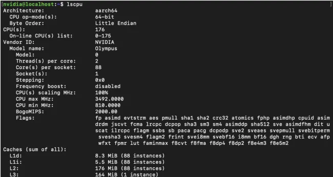

# NVIDIA Vera CPU

## 前言

NVIDIA 作为 AI 浪潮下最大的"卖铲人"，并不满足于只做 GPU 的供应商，而是给自己定位成了 AI 训推的全套解决方案供应商。Vera CPU 的介绍页上写着：**Purpose-Built for Agentic AI**。

这个标题已经透露了不少信息了：

1. 老黄认为，未来的 AI（也可以说是现在的 AI），形态上就是 Agentic AI。
2. Vera CPU 是专门针对 Agentic AI 设计的。


## 基本参数

Vera 与上一代的 Grace 不同，使用了 NVIDIA 自己研发的 Olympus 核心，宣称是上一代性能的两倍，且兼具优异的能效。

兼容 ARMv9.2 指令集，支持 FP8 精度。88 个 Olympus 核心，每个核心支持 2 个线程。

配备了 LPDDR5X 内存，内存带宽高达 1.2 TB/s。与 Grace 相比，L2 Cache 容量翻倍，每个核心 2 MB；L3 Cache 容量达到了 164 MB。

支持 PCIe 6.0 和 CXL 3.1。

峰值 TDP 450W。由于使用了 LPDDR5X，功耗控制更佳。



另外，还可以看到，基频到了 3.5 GHz，相当高。

## Benchmark

gem5 测试中，Vera 的多核性能表现略优于 2 × AMD 9755，单核性能介于 AMD EPYC 9575F 和 9475F 之间。在 ARM 阵营中，是相当炸裂的性能表现了。

STREAM 测试中，Vera 使用 STREAM 的开源上游版本，GCC 编译下，就跑出了超过第二名 60% 的成绩，堪称恐怖。LPDDR5X 发力了！

在 Python 和 Java 的性能测试中，Vera 的性能表现相当出色，符合其 Data Center 的定位。

> _On a geo mean basis, the NVIDIA Vera delivered **10% better performance than the AMD EPYC 9575F 5.0GHz** high frequency processor. For gen-on-gen compared to Grace, **Vera was coming in at 1.63x the performance geo mean**. Over a single Intel Xeon 6980P as Intel's current flagship Granite Rapids processor, **NVIDIA Vera delivered 1.55x the performance**._

更多测试结果可以参考[这篇文章](https://www.phoronix.com/review/nvidia-vera-benchmarks)。

## 微架构

首先可以从官方获取一些信息：

> Built for sustained high Instruction Per Cycle (IPC) operation on memory-intensive workloads with control-flow logic, Olympus uses a **10-wide instruction fetch and decode** frontend, and a neural branch predictor capable of evaluating **two taken branches per cycle**.

Olympus 核心的解码宽度达到了10，但是没有说明后端的发射宽度是多少，一般来说，后端的发射宽度是要高于解码宽度的，所以发射宽度至少也是10（对比AMD 9755为前端8解码，后端8发射）。

神经网络分支预测器能够在一个 cycle 中预测两个分支。

> The Vera CPU is built on a single monolithic compute die and fabric

只有一个计算 die，因此没有numa带来的非一致性访存延迟问题。

Vera 是基于 Olympus 自研核心设计，且目前没有公开微架构图，更多的信息也很难再找到了。但是并不是说没有办法来做一些研究。GCC 16.1 版本中，已经对 Vera 的微架构进行了适配，所以可以看到一些相关信息。
获得 gcc-16.1/gcc/config/aarch64/olympus.md 文件，可以获得一些信息。

```md
(define_attr "olympus_dispatch"
"none,b,i,m,m0,l,v,v0,v03,v12,v45,v0123,m_v,l_v,m_l,m_v0123,v_v0123,\
 l_v03,sa_d,sa_v0123,sa_v_v0123"
```

流水线组有很多，但是类别可以分为`b,i,m,l,v,sa`六类。
|流水线类别|描述|
|----------|----|
|b|分支|
|i|整数|
|m|乘法|
|l|加载|
|v|向量|
|sa|store address|

可以顺便和 Neoverse V2 对比一下：

```md
(define_attr "neoversev2_dispatch"
"none,bs01,bsm,m,m0,v02,v13,v,l01,l,bsm_l,m_l,m0_v,v_v13,v_l,\
 l01_d,l01_v"
```

| 流水线类别 | 描述        |
| ---------- | ----------- |
| b          | 分支        |
| s          | 移位        |
| m          | 乘法        |
| v          | 向量        |
| l          | load，store |

Neoverse V2 有 5 个类型的流水线，且如 bsm 这样的流水线都可以完成整数类型的运算，功能上有重叠，如文档中：

```md
(ior
(eq_attr "type" "adc_reg,alu_ext,alu_imm,alu_sreg,alus_ext,\
 alus_imm,alus_sreg,clz,csel,logic_imm,logic_reg,logics_imm,\
 logics_reg,mov_imm,rbit,rev,shift_reg")
(eq_attr "sve_type" "sve_pred_cnt_scalar"))
(const_string "bsm")
```

这里可以发现 Olympus 和 Neoverse V2 流水线上的区别：

1. Olympus 的流水线类别分得更细。把 store 和 load 都拆成了两类流水线，猜测是为了应对 AI 场景下的高吞吐需求。而neoversev2则倾向于资源共用。
2. Neoverse V2 的流水线更简单，只有 5 个类型。
3. Olympus 的向量处理流水线很丰富，推测大幅增强了 SIMD 能力。当然也可能是为了支持 FP8 精度。

## 总结

现在总结一下已有的信息：

1. NVIDIA 的 Olympus 自研核目前看来确实是地表最强 ARM 核心；
2. Olympus 针对内存性能做了相当大的优化，内存带宽高达 1.2 TB/s，流水线上也把 load 和 store 分离，且针对向量的 LS 做了专门优化，可以预见向量化性能会有很大提升；
3. 88核，支持SMT. 单个计算DIE，保证了所有核心访存性能是一致的。

## 参考

1. [NVIDIA Vera CPU 介绍](https://www.nvidia.com/en-us/data-center/vera-cpu/)
2. https://www.phoronix.com/review/nvidia-vera-benchmarks
3. https://developer.nvidia.com/blog/nvidia-vera-cpu-delivers-high-performance-bandwidth-and-efficiency-for-ai-factories/
