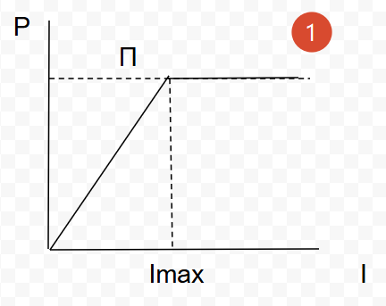
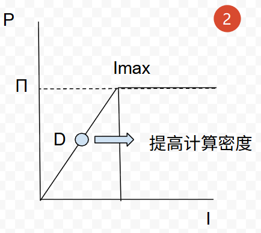
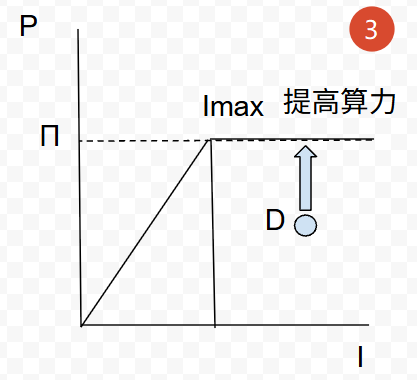
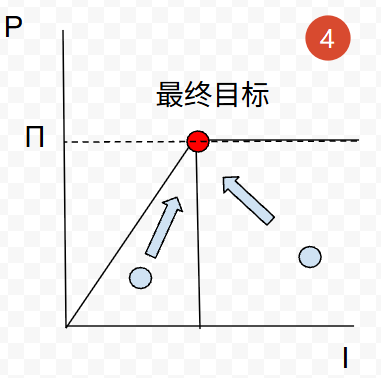

# Roofline模型

## 前言

roofline模型基本是搞HPC入门必学知识，得益于现在AI的盛行，传播范围更广了。之前也曾了解过这个模型，今天重新整理回顾一下，顺便研究一些细节问题。非正式行文风格，想到哪写哪。

## 第一印象

roofline，直译就是【屋顶】【轮廓线】，和现在火热的“如何给token取一个中文名”不同，roofline并没有一个统一的中文名。这个名字也完全是形意的命名方法。


## 解决什么问题？

稍微对集成电路有点了解的都会知道“摩尔定律”这个东西，摩尔定律以一种十分粗犷的方法“量化”了集成电路的发展速度。现在一些发布会也喜欢说xx提高的x倍这样的宣传词，但是拿到产品后总感觉这种宣传夸大其词。那么按照摩尔定律，即使没撞到物理墙，现在CPU的性能也应该到一个十分夸张的地步，但实际上并没有。

这个问题，本质上是因为程序不仅要“算”还要“存”，计算能力和数据搬运能力的巨大差距会导致空有算力但使不上劲。实际上，带宽的变大速度也远落后于算力发展的速度。

当前国产计算卡都说达到了NV H100的多少多少，但是实际一跑完全不那么回事，你说这是虚假宣传吗，也不是，纸面数据上确实达到了，限制仍然是数据搬运效率的差距。而回到今天的主题，roofline就是一个能够量化什么时候算力瓶颈，什么时候数据搬运瓶颈，这样一个模型。

## 公式

既然是可量化，那就一定要有公式。上图模型中，有这几个量：

P--实际的的算力，单位是FLOP/s

π--最大理论算力

β--最大内存带宽，单位是Byte/s

I--计算强度，是roofline模型中定义的一个概念。使用算力除以带宽得到。从字面上，它表示单位数据被计算了多少次。不同的程序在一台设备上有自己的一个计算强度，这个计算强度是软件概念

Imax--最大计算强度。算力和内存带宽都受限于硬件，存在一个理论上限值，注意这个计算强度是硬件概念上的。理想状况下，我们希望算力能达到最大，同时内存带宽也能达到最大，也就是完全榨干硬件资源。此时的计算强度就是最大计算强度。

roofline模型可以说就是一个描述算力-计算强度的关系图

## 应用流程

这个模型还是要辅助实际工程问题的解决的。实际场景中（HPC, 大模型这种场景），先计算出环境的理论最大算力π，理论最大带宽β，然后就可以绘制出roofline了。



然后采集待分析程序的实际FLOPS和带宽，就可以计算出计算强度I。

带宽实际上是比较好采集的，有很多现成的工具，intel的vtune，nvidia的nsight等。

FLOP/s同样可以使用perf采集FMA单元的PMU事件次数得到。

得到这两个指标，就可以计算出这个程序的计算强度I，且有了一个二维坐标 D（P, I）。那么这个D的位置可能落在roofline线的外部吗？

首先，D不可能超过π理论最大算力，也就是D点一定在屋顶线下；
而屋檐的斜率代表着理论带宽的上限，同样D点也不能超出。

| D的位置    | 优化方向                         |
| ---------- | -------------------------------- |
| 在Imax左侧 | 带宽受限，应优先优化数据吞吐     |
| 在Imax右侧 | 算力受限，理想情况，或可优化算力 |

### 阴影

roofline模型给出的是“优化算法”还是“优化数据搬运”这样的方向性问题。但实际场景中，基本都是既跑不满算力，又跑不满带宽的这样的场景。计算得到的I压根就不在roofline的线上。

带宽不可能都搬运的有效数据，只要发生cache miss，就达不到理论的带宽瓶颈；

算力也不可能时刻都用满SIMD，流水线停顿，指令依赖同样也会限制理论最大算力；

#### 左侧屋檐线下

左侧屋檐线在理论最大计算强度的左侧，意味着单位时间的计算次数并不多，算力还没有被完全发挥出来，所以这时的目标是移动D点到右侧的算力瓶颈区。

这个位置的优化，实际上是提高计算强度，使一份数据单位实际内能被计算更多次：

1. 减少分支开销，数据要顺序访问（利用硬件预取），优化数据布局（常用数据放在L1/L2 cache中）
2. 如果实在无法优化代码，可以换高频率内存，上HBM



#### 右侧屋顶线下

右侧屋顶线下，P点同样没有达到算力和带宽的理论上限值，但这部分计算强度很高，意味着单位时间内处理的数据量已经很大了，再送更多的数据，计算单元也算不过来了。所以优化访存反而收益不大。这里如果得出“那就去提高算力”的结论反而有些形而上了。其实D点在这个区域，说明程序的可优化空间已经很有限了。

虽然说这个区域优化空间已经不大了，可以检查一下下面的手段：

1. 使用高效率的指令集，比如AVX512，AMX等。SIMD指令可以在一个周期对多个数据进行计算
2. 优化算法，复杂度是不是过高？一份数据是不是被没必要的使用了多次？
3. 并行化。如果有多个核心可以用，是否所有算力都被用上了？

这些优化手段反而是降低计算强度的思路，颇有种“面多了加水，水多了加面”的感觉。





## 一些问题

### 为什么要引入计算强度这个概念？

算力（FLOPS）和带宽（byte/s）是独立的概念。工程上，只能得到“当前算力 or 带宽有没有达到理论峰值”这样的结论，无法确定到底是算力受限还是带宽受限。

引入计算强度后，一方面可以获得当前程序在这台设备上的计算特征，它反映了一份数据在算法层面要被计算多少次。有了Imax后，就有了一个“基准”。根据小学知识，分子（算力）和I正相关；分母（带宽）和I负相关（但是这里不讨论分母，因为模型中是算力-计算强度的关系图），那么当I大于Imax时，注意此时的算力P已经达到了最大算力，而带宽仍有余量，进而推导出，I大于Imax是计算受限。当I小于Imax时，同样的，带宽已经达到了理论最大带宽，反而算力仍有余量，进而推导出，I小于Imax是带宽受限。

因此，引入计算强度I后，工程上的操作流程就是：1.计算Imax；2.计算I；3.比较I和Imax。最费劲的反而是计算I，需要使用合适的工具获得应用的FLOPS和带宽。

### 带宽-计算强度模型？

既然了解了原理，那么使用带宽-计算强度模型效果一样，同样可以画出带宽-计算强度的roofline

### 理论最大算力怎么计算？

公式为：核数\*核频率\*FMA单元数量\*2\*计算宽度

但是这里我们不算CPU的，而是来计算一下计算卡的最大算力（纯蹭AI），但是要算计算卡最大算力，首先要了解计算卡的架构。

以我自己的显卡，nv的3060ti为例，3060ti是ampere架构，主频按照boost频率为1665MHz，核心为GA104, 有38个SM（Streaming Multiprocessor），一个SM被分为4个区块，一个区块有16个只计算FP32的单元和16个既能计算FP32又能计算INT32的单元。那么就可以计算如下：

```
38*4*16*2*1665*2=16.2TFLOPS
```

但是据了解，这只是标量的最大理论算力，上面的core也叫cuda core，实际上nv的卡里面还有tensor core来专门加速AI计算。下面来计算一下tensor core的最大算力：一个SM中有4个tensor core，每个tensor core在一个周期内执行的是一个AxB+C的矩阵乘加（而上面的cuda core和CPU一样是标量的FMA）,叫MMA（Matrix Multiply Add）。一个tensor core一个周期可执行256次FP16的FMA操作，所以计算如下：

```
38*4*256*2*1665=129.57TOPs
```

这个MMA操作把算力上限提高了很多。

_其实nv的卡的特性还挺复杂的，可以发现特化了很多不同的计算单元，算力计算起来比CPU复杂多了_
