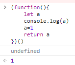

# 关于工作半年后被const坑了一把这件事
## 起因
在某个crazy Thursday，我买了M记的穷人套餐回到住处，然后还在加班的同事发现我代码有问题并截图给我，代码大致如下：

```
const Component=({url,list})=>{
  const fetchData=async ()=>{
    const url=url||list?.[0]
    //...
  }
}
```

同事当时说什么“变量提升”、“你这个url永远是undefined”，我乍一下还没理解，一个const有什么变量提升呢？
我当时的想法是，赋值符号右侧先计算再赋值给左边，所以先获取外层作用域中的url值，再赋给左侧的url，获得一个fetchData作用域内的url变量。但实际这是**错的**！可以在控制台写几个demo。




es6新增的`let`和`const`声明，区别于`var`，`var`是有*变量提升*这个东西的，但是这俩声明是没有的。我理解这点，但是对这俩声明的具体细节还不够，并想当然的认为let和const创建变量是在赋值号右侧计算完毕后。直接去看一下ECMAScript doc。
> NOTE:
let and const declarations define variables that are scoped to the running execution context’s **LexicalEnvironment**. The variables **are created when their containing Lexical Environment is instantiated** but may not be accessed in any way until the variable’s LexicalBinding is evaluated. A variable defined by a LexicalBinding with an Initializer is **assigned the value of its Initializer’s AssignmentExpression when the LexicalBinding is evaluated**, **not when the variable is created**. If a LexicalBinding in a let declaration does not have an Initializer the variable is assigned the value undefined when the LexicalBinding is evaluated.

标准的意思大概是，变量创建的时刻是在词法域实例化后；但是赋值时刻是在词法绑定并赋值运算后。也就是在赋值运算前，变量是不能被访问的，访问就会报错。且如果let声明的变量没有初始化值，初始化值就为undefined，但是const声明必须要有初始化值，否则也会报错。
另外，关于**变量提升**这个问题，js中let，const，var三种声明都是有变量提升的作用的，只不过let和const多了一个叫**暂时性死区（TDZ）**的时期，也就遮蔽了变量提升这个效果。

而为什么我写了这段错误的代码却没有报错，原因也找到了。babel在做语法降级的时候将const和let全部编译成了var。由于公司的项目比较老了，甚至还有babel-preset-es2015这种东西，所以我直接在build出的vender中检索了一下，确实只有var。至此，问题也算是都解决了，感慨：学无止境啊！