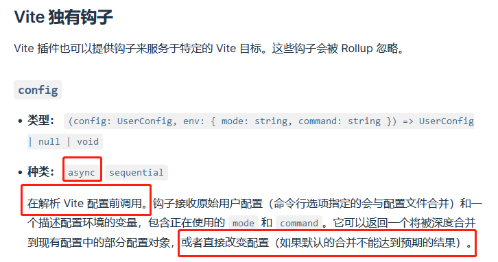

# Vite使用初探
## 业务背景
公司是做数据产品的，某条业务线中爬取数据的收益难以覆盖成本，为提高数据利用率，需要将这部分数据作为独立的业务进行售卖。

该业务leader给了较大的自主权限。
## 技术栈选择
公司业务主要为react，因此仍使用react进行开发。由于ts使用不熟练，考虑到项目的规模，为保证开发效率，仍然使用js。脚手架方面可选项不多（因为我会的不多。。），就可知的项目规模来说，使用webpack和vite的区别不大，webpack更加稳定，但是配置起来比较繁琐；vite开发阶段体验好，但是项目规模不到一定程度体会不出来。最终因为“懒是第一生产力”，个人看重了vite开箱即用，且项目没有历史包袱，最终采用了vite。
## 开发环境配置
*多少还是要配点环境的。*

### 建立仓库结构
使用vite创建好仓库后，需要对文件结构稍加改动以适应开发习惯。
```
├─ src
│  ├─ app // 页面
│  ├─ assets // 媒体类型资源
│  ├─ base // 基础方法
│  ├─ components // 公共组件
│  ├─ index.css
│  └─ main.jsx
```
### 路径问题
生产环境中，项目不一定是在根目录下的。因此需要对公共基础路径进行配置。这里偷个懒先写个相对路径。
```js
// vite.config.js
base:'./'
```
然后，路径相关的别名也可以方便日常的开发。
```js
// vite.config.js
resolve.alias:{
  '@':'./src'
}
```
但是这仅仅是使vite能够识别别名路径，在日常开发中，点击路径进行跳转也是一个很方便的功能，但是这属于vscode的功能，需要配置[jsconfig.json](https://code.visualstudio.com/docs/languages/jsconfig)文件。
```json
{
  "compilerOptions": {
    "baseUrl": ".",
    "jsx": "react-jsx",
    "paths": {
      "@/*": [
        "./src/*"
      ],
    }
  },
  "exclude": [
    "node_modules"
  ],
  "include": [
    "src/**/*"
  ]
}
```
### proxy
目前的项目上点规模的基本都是前后分离的。开发阶段对接口请求的反向代理设置必不可少。参考vite文档进行设置即可。
```js
export default defineConfig({
  server: {
    proxy: {
      '/api': {
        target: 'http://jsonplaceholder.typicode.com',
        changeOrigin: true,
        configure: (proxy, options) => {
          // proxy 是 'http-proxy' 的实例
        }
      }
    }
  }
})
```
需要注意的是独立业务没有登录功能，需要在启动vite服务器时调用登录接口获取token。这部分在之前的文章中有提及:point_right:[集成sso的前端项目在开发阶段绕过登陆](/tech/sso)。

但经过这段时间，我发现了一种更好的写法，那就是vite的[自定义插件](https://cn.vitejs.dev/guide/api-plugin.html#universal-hooks)。vite服务器在生命周期中向外暴露出了一些hooks，这里的目标是在vite服务器启动时获取token，并将tokens写进cookie中。所以，要使用的是vite插件。

简单的说就是将token写入proxy配置的逻辑单独出一个插件，仅此而已。
### 环境变量
项目中多少有一些东西是和环境类型有关的，如开发环境跳转和生产环境跳转地址不同。这部分内容参见文档即可。需要注意的是，项目源码使用环境变量必须以VITE_开头，而vite相关配置如果要使用环境变量需要引入loadEnv来加载，这一点官方没说明白。
### 生产环境去除console和debugger
到这里其实已经属于优化部分了。vite默认使用的是esbuild打包。在esbuild选项中配置即可。
```js
  esbuild: {
    drop: mode === 'production' ? ['console', 'debugger'] : []
  },
```
比较坑的是，vite的build选项中还有terserOption，一些熟悉terser的可能就直接用terser去除console了，但是不将build.minify设置为terser，这个terserOption就不会生效。而万一设置了，minify就会使用terser，esbuild的优势就用不上了。这文档多少有点坑。
