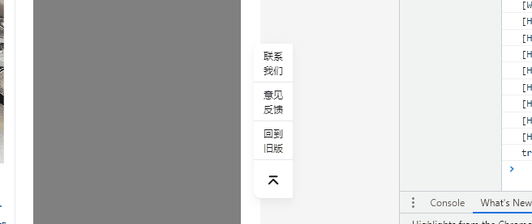

# DOM *Observer API
JavaScript中有一个observer系列的api，分别为IntersectionObserver，ResizeObserver, MutationObserver，十分的有意思。
## ResizeObserver
### 背景
又是一个周六，由于组内一小姐姐离职，我要去接受她的项目，加上产品直接定了版本发布日。我又“自愿”加班去了。

加班不可避免，只能思考如何让加班变得有效。

场景需求：实现页面右下的固钉，距离viewport底部固定距离；紧贴内容部分右侧，页面宽度小于内容宽度时，固钉紧贴viewport右侧。



### 思路
能用CSS解决的先用CSS解决。分析需求可知：
1. 距离视窗底部固定距离，显然是`position: fixed;`;
2. 横向的行为类似于`position: sticky`，但是仔细一想，是和需求1冲突的。

也许这种效果确实能用CSS实现，但已经不是我一时半会能想出来的了。因此直接js介入。

方案：纵向位置使用css的fixed定位实现，横向位置使用js来控制。

### 实施
固钉的位置与页面距离视窗右侧的距离有关，细分下，需要实现对window宽度变化的监听，并实时计算页面主体距离右侧视窗的距离。

#### 事件监听
监听window的宽度变化可以使用(前端程序员)都知道的`addEventListener('resize',callbakc)`方法，需要注意的是：
1. resize事件只能监听window；
2. 该事件会高频触发，基本都需要做节流。

顺手来上一段MDN的节流方案：
```js
// requestAnimationFrame + customEvent
;(function() {
    var throttle = function(type, name, obj) {
        obj = obj || window;
        var running = false;
        var func = function() {
            if (running) { return; }
            running = true;
             requestAnimationFrame(function() {
                obj.dispatchEvent(new CustomEvent(name));
                running = false;
            });
        };
        obj.addEventListener(type, func);
    };

    /* init - you can init any event */
    throttle("resize", "optimizedResize");
})();

// handle event
window.addEventListener("optimizedResize", function() {
    console.log("Resource conscious resize callback!");
});
```
#### ResizeObserver
事件监听通常和节流绑定，显得上面的实现内聚性少了那么点意味。DOM还有一个*Observer系列的api，ResizeObserver就是其中一个。

> ResizeObserver 接口可以监听到 Element 的内容区域或 SVGElement的边界框改变。内容区域则需要减去内边距 padding。
ResizeObserver 避免了在自身回调中调整大小，从而触发的无限回调和循环依赖。它仅通过在后续帧中处理 DOM 中更深层次的元素来实现这一点。如果（浏览器）遵循规范，只会在绘制前或布局后触发调用。

MDN并没有解释很清楚，我又找了其他说明 :point_right: :[ResizeObserver: it’s like document.onresize for elements](https://web.dev/i18n/en/resize-observer/#when-is-it-being-reported)

> When is it being reported? 
The spec proscribes that ResizeObserver should process all resize events before paint and after layout. This makes the callback of a ResizeObserver the ideal place to make changes to your page's layout. Because ResizeObserver processing happens between layout and paint, doing so will only invalidate layout, not paint.

看样子并不需要进行额外的节流处理。由于是在react中使用，顺手写一个hook：
```js
export const useResizeObserver = (target, callback) => {
  const resizeObserver = new ResizeObserver((entries) => {
    for (const entry of entries) {
      callback(entry)
    }
  })
  useEffect(() => {
    resizeObserver.observe(target)
    return () => {
      resizeObserver.disconnect()
    }
  }, [])
}
```
之后将监听document.body的回调作为callback传入即可。
#### 右边距计算
实现了对window的监听后，需要得到页面主体到视窗右侧的距离，这里使用`element.getBoundingClientRect()`，但是这个api所有的属性都是相对于视窗左上的，还需要使用`window.innerWidth`减一下才能得到距离右边的距离。

至此，功能就完成了。但是总感觉功能实现的不是很漂亮。